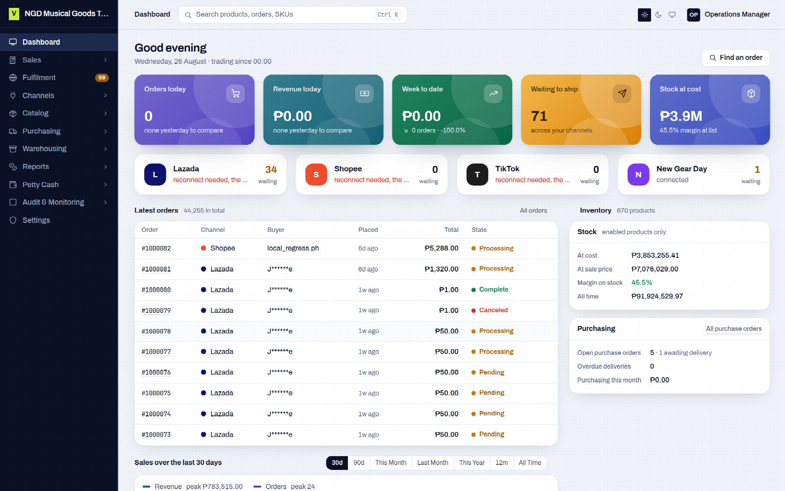

# VentaSync

**One ERP for sellers on Shopee, Lazada, TikTok Shop, OpenCart and VentaCart.**

One catalog pushed to every store, every order in one list with its profit, and stock deducted as orders come in. Run as many shops per marketplace as you need. Open source, self-hosted, your data on your server.



Website: [ventasync.com](https://ventasync.com)

## What is included

- Master Catalog with variations, pictures and per-store listings
- Shopee, Lazada and TikTok Shop, several shops each: listings, orders, returns, reviews, fulfilment and payouts
- OpenCart and VentaCart storefronts
- Users, user groups and permissions
- A REST API for your own tools and a sign-in API for your own mobile app

## Server requirements

- PHP 8.2 or newer with `bcmath`, `ctype`, `curl`, `dom`, `fileinfo`, `gd`, `intl`, `mbstring`, `openssl`, `pdo_mysql`, `tokenizer`, `xml`, `zip`
- MySQL 8.0+ or MariaDB 10.6+
- Composer 2
- nginx or Apache, with the document root on `public/`
- Cron, to run the scheduler every minute
- A public domain with HTTPS, so the marketplaces can send sellers back after they connect a store

## Install

```bash
git clone https://github.com/VentaVerse/ventasync.git
cd ventasync
composer install --no-dev --optimize-autoloader

cp .env.example .env        # set APP_URL and the DB_ values
php artisan key:generate
php artisan migrate --force --seed
php artisan storage:link
chmod -R 775 storage bootstrap/cache
```

Add the scheduler to cron. Order syncs, stock and price pushes and token refresh all run from it:

```
* * * * * php /path/to/ventasync/artisan schedule:run >> /dev/null 2>&1
```

Open your domain. The first page asks you to create the administrator account. Stores are connected from inside the app.

Web server examples, upgrades and troubleshooting are in [INSTALL.md](INSTALL.md).

## VentaSync Pro

WooCommerce, Shopify, purchasing, warehouses, reports, petty cash, the mobile app and the AI assistant come with VentaSync Pro. See [ventasync.com](https://ventasync.com).

## License

[AGPL-3.0-or-later](LICENSE).
